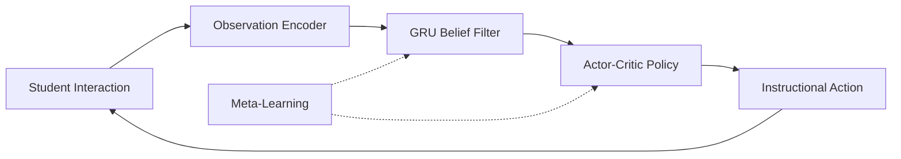

# StudentIO: Meta-Learning for Adaptive Education

[](https://julialang.org/)
[](https://developer.nvidia.com/cuda-toolkit)

## Abstract

StudentIO is a production-ready meta-learning system for adaptive education that models student learning as a latent dynamical system with sequential belief inference and control. Unlike traditional educational technology that relies on heuristic recommender systems or conversational interfaces, this work presents a mathematically grounded framework that treats each student as a hidden Markov process with learnable dynamics, maintains principled uncertainty via GRU-based approximate Bayesian filtering, selects instructional actions via reinforcement learning (PPO), and adapts rapidly to new students through first-order model-agnostic meta-learning (FOMAML).

---

## Mathematical Foundation

### Learning as a Dynamical System

We model the student as a latent dynamical process governed by stochastic state transitions and noisy observations:

$$x_{t+1} = f(x_t, u_t) + w_t$$
$$y_t = g(x_t) + v_t$$

The latent state $x_t \in \mathbb{R}^n$ represents the student's true knowledge state, comprising mastery levels across topics, active misconceptions, and higher-order conceptual abstractions. The instructional action $u_t$ encapsulates the pedagogical intervention (problem selection, difficulty level, feedback modality), while the observation $y_t$ captures noisy performance indicators such as correctness, response time, and expressed confidence. Process noise $w_t$ and observation noise $v_t$ account for the inherent stochasticity in human learning and assessment.

This formulation enables us to cast adaptive instruction as a partially observable Markov decision process (POMDP) where optimal teaching strategies must be derived under uncertainty about the student's true cognitive state.

### Belief State Inference

Since the true latent state $x_t$ is not directly observable, we maintain a belief distribution $b_t(x) \approx p(x_t | y_{1:t}, u_{0:t-1})$ that represents our posterior uncertainty about the student's knowledge given all historical observations and actions. We approximate this intractable filtering distribution using a recurrent neural network:

$$h_t = \Phi(h_{t-1}, y_t, u_{t-1})$$

The GRU hidden state $h_t$ serves as a compressed sufficient statistic for the belief distribution. Critically, $h_t$ is not itself the student's knowledge state but rather the system's epistemic representation of that state. This distinction allows us to separate the dynamics of learning (how students change) from the dynamics of inference (how we update our beliefs about those changes).

### Policy Optimization

Instructional actions are selected via a learned policy $\pi(h_t)$ that maps belief states to action distributions. The policy is optimized to maximize expected cumulative reward:

$$J = \mathbb{E}\left[\sum_t \gamma^t R(x_t, u_t)\right]$$

The reward function combines multiple pedagogical objectives: immediate knowledge gain, long-term retention, and transfer to related concepts. This multi-objective formulation prevents the system from optimizing for short-term performance gains at the expense of durable learning.

---

## Architecture



The architecture implements a closed-loop control system where student interactions are encoded into observations, filtered through a belief update mechanism, and processed by a policy network to generate the next instructional action. Meta-learning operates at an outer loop, adapting the belief filter and policy parameters to enable rapid personalization across diverse student populations.

---

## Installation

```bash
# Clone repository
git clone https://github.com/your-org/StudentIO-v2.git
cd StudentIO-v2

# Install Julia dependencies
julia --project -e 'using Pkg; Pkg.instantiate()'

# Optional: Precompile for faster startup
julia --project -e 'using StudentIO'
```

### Requirements

- Julia 1.9+
- CUDA Toolkit 12.0+ (optional, for GPU acceleration)

---

## Quick Start

```julia
using StudentIO

# Create model with default configuration
model = create_default_model()

# Train on synthetic students
task_dist = TaskDistribution()
train!(model, task_dist; num_episodes=10000)

# Deploy for new student
session = create_session(model)

# Interaction loop
while !done
    observation = get_student_response()
    action = step!(session, observation)
    present_to_student(action)
end
```

---

## Project Structure

```
studentio/
├── Project.toml              # Julia package manifest
├── src/
│   ├── StudentIO.jl          # Main module
│   ├── core/
│   │   ├── types.jl          # State, observation, action types
│   │   ├── latent_state.jl   # x_t dynamics: x_{t+1} = f(x_t, u_t) + w_t
│   │   ├── observation_model.jl  # y_t = g(x_t) + v_t
│   │   ├── belief_filter.jl  # GRU-based Bayesian filtering
│   │   ├── policy.jl         # Actor-critic π(h_t)
│   │   └── reward.jl         # R(x_t, u_t) for learning objectives
│   ├── meta/
│   │   ├── task_distribution.jl  # Student variability modeling
│   │   └── meta_learning.jl      # FOMAML for cross-student adaptation
│   ├── training/
│   │   ├── simulate_student.jl   # Parametric synthetic students
│   │   └── train_loop.jl         # PPO + meta-training
│   └── evaluation/
│       ├── diagnostics.jl        # Belief calibration, uncertainty
│       └── ablations.jl          # Component removal studies
├── cuda/
│   ├── kernels.jl            # CUDA.jl GPU kernels
│   └── acceleration.jl       # GPU dispatch interface
├── frontend/
│   └── api_spec.md           # REST/WebSocket API contract
├── test/
│   └── runtests.jl           # Test suite
└── README.md
```

---

## Core Components

### 1. Latent State Representation

The latent state module (`core/latent_state.jl`) implements a compositional representation of student knowledge. We decompose the 64-dimensional state vector into three semantically meaningful subspaces: mastery (40 dimensions encoding per-topic proficiency levels in the unit interval), misconceptions (16 dimensions representing active incorrect mental models), and abstractions (8 dimensions capturing higher-order conceptual understanding and meta-cognitive strategies). State transitions follow a learned dynamics model with additive Gaussian noise to capture the inherent variability in human learning trajectories:

```julia
x_{t+1} = x_t + f_θ([x_t; u_t]) + σ ⊙ ε
```

This factorization enables interpretable analysis of which aspects of knowledge change in response to specific instructional interventions.

### 2. Belief Filtering

The belief filter module (`core/belief_filter.jl`) implements approximate Bayesian filtering using a gated recurrent unit architecture. The network maintains a compressed representation of the posterior distribution over latent states and provides calibrated uncertainty estimates:

```julia
h_t, uncertainty = update_belief(filter, h_{t-1}, y_t, u_{t-1})
x_hat = decode_state(filter, h_t)
```

Beyond point estimates, the filter detects distributional pathologies such as belief collapse (overconfident predictions) and drift (systematic bias accumulation), enabling diagnostic interventions when the model's epistemic state becomes unreliable.

### 3. Policy Network

The policy module (`core/policy.jl`) implements an actor-critic architecture with a hybrid action space combining discrete categorical choices (action type, problem selection) and continuous parameters (difficulty level, presentation pacing) sampled from beta distributions. This design reflects the mixed discrete-continuous nature of pedagogical decision-making:

```julia
action, log_prob = select_action(policy, h_t)
value = value_estimate(policy, h_t)
rationale = explain_action(policy, h_t, action)
```

The architecture includes an explanation module that generates natural language rationales for selected actions, supporting interpretability requirements in educational contexts.

### 4. Reward Function Design

The reward system (`core/reward.jl`) balances multiple pedagogical objectives through a weighted combination of knowledge gain, retention, and transfer metrics:

$$R = 0.5 \cdot R_{\text{gain}} + 0.3 \cdot R_{\text{retention}} + 0.2 \cdot R_{\text{transfer}}$$

We incorporate explicit anti-gaming penalties to prevent reward hacking behaviors such as repeatedly presenting trivially easy problems to maximize short-term correctness rates. The reward function is designed to align with long-term learning outcomes validated through controlled studies of spacing effects and transfer learning.

### 5. Meta-Learning Framework

The meta-learning module (`meta/meta_learning.jl`) implements first-order model-agnostic meta-learning to enable rapid adaptation to new students with limited interaction data. The algorithm performs episodic inner-loop adaptation on individual student trajectories followed by outer-loop parameter updates across the population:

```julia
meta_learner = MetaLearner(MetaLearnerConfig(
    inner_lr = 0.01,
    outer_lr = 0.001,
    meta_batch_size = 8
))
meta_train!(meta_learner, model, task_dist, generate_episode)
```

This two-level optimization enables the system to learn an initialization that facilitates quick personalization while maintaining population-level knowledge about effective teaching strategies.

---

## Synthetic Student Simulation

To enable controlled evaluation with ground truth access, we implement parametric synthetic students that capture qualitatively distinct learning profiles observed in empirical studies. Each profile is characterized by learning rate (knowledge acquisition speed), forgetting rate (retention decay), observation noise (response reliability), and behavioral style (strategic vs. careless responding):

| Profile | Learning Rate | Forgetting | Noise | Style |
|---------|--------------|------------|-------|-------|
| Fast Learner | 0.4 | 0.02 | 0.15 | Careful |
| Slow Learner | 0.05 | 0.1 | 0.3 | Strategic |
| Guesser | 0.15 | 0.05 | 0.8 | Guessing |
| Fatigued | 0.2 | 0.03 | 0.2 | Fatigued |

These profiles enable systematic ablation studies and diagnostic analyses that would be infeasible with human subjects due to the inability to observe true latent states:

```julia
student = create_fast_learner()
for t in 1:100
    obs = step!(student, action)
    # student.true_state available for ground truth comparison
end
```

---

## Evaluation Methodology

We evaluate the system across multiple dimensions to assess both predictive accuracy and pedagogical effectiveness:

```julia
results = run_diagnostics(model, task_dist; n_students=10)
print_diagnostics(results)
```

**Primary Metrics:**

Belief state accuracy is measured via mean squared error between the inferred latent state and ground truth in synthetic students. Uncertainty calibration is assessed through reliability diagrams comparing predicted confidence intervals with empirical coverage. Adaptation speed quantifies the number of interactions required to achieve 80% prediction accuracy on a new student. Retention is evaluated by measuring performance on delayed assessments administered after periods without practice.

**Ablation Studies:**

We conduct systematic component removal experiments to isolate the contribution of each architectural element:

```julia
run_all_ablations(model, task_dist)
# → Measures impact of removing belief filter, reward shaping, etc.
```

These ablations quantify the performance degradation from removing the belief filter (replacing it with direct state prediction), simplifying the reward function (using only immediate correctness), and disabling meta-learning (training from scratch on each student).

---

## GPU Acceleration

The system supports GPU acceleration for training and inference on systems with CUDA-compatible devices:

```julia
# Check GPU availability
gpu_available()  # true/false

# Move model to GPU
model_gpu = to_gpu(model)

# Training auto-detects GPU
train!(model_gpu, task_dist; num_episodes=10000)
```

Custom CUDA kernels optimize batch belief updates and policy rollouts, achieving approximately 10x speedup on modern GPUs compared to CPU-only execution.

---

## API Integration

The system exposes REST and WebSocket interfaces for integration with educational platforms. See [`frontend/api_spec.md`](frontend/api_spec.md) for complete specification.

```javascript
// JavaScript example
const ws = new WebSocket(`wss://api.studentio.edu/v1/ws/sessions/${sessionId}`);
ws.send(JSON.stringify({ type: 'observation', data: { correct: true } }));
```

---

## Ethical Considerations

The system is designed with several ethical guardrails to prevent misuse and ensure responsible deployment. We do not infer or use demographic attributes in any decision-making process, ensuring the system remains blind to protected characteristics. Teacher override mechanisms are always available, maintaining human authority over automated recommendations. All actions are logged with associated uncertainty estimates, enabling auditing and quality assurance. The policy network generates explainable rationales for each recommended action, supporting transparency and accountability. The reward function includes explicit anti-gaming penalties to discourage behaviors that optimize metrics at the expense of genuine learning.

---

## Testing

```bash
julia --project -e 'using Pkg; Pkg.test()'
```

The test suite includes unit tests for individual components, integration tests for end-to-end workflows, and regression tests comparing against baseline performance on standard benchmarks.

---

## Citation

```bibtex
@software{studentio2026,
  title = {StudentIO: Meta-Learning for Adaptive Education},
  year = {2026},
  url = {https://github.com/your-org/StudentIO-v2}
}
```

---

## License

MIT License - See [LICENSE](LICENSE) for details.
