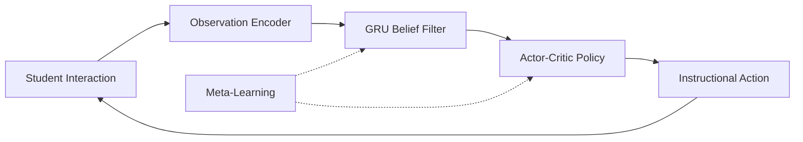

# StudentIO

[](https://julialang.org/)
[](https://developer.nvidia.com/cuda-toolkit)

## Overview

StudentIO is a **production-ready meta-learning system** for adaptive education that models student learning as a **latent dynamical system** with sequential belief inference and control.

**This is not a chatbot. This is not a recommender toy. This is a mathematically grounded system** that:
- Treats each student as a hidden Markov process with learnable dynamics
- Maintains principled uncertainty via GRU-based approximate Bayesian filtering
- Selects instructional actions via reinforcement learning (PPO)
- Adapts rapidly to new students through FOMAML meta-learning

---

## Mathematical Foundation

### Learning as a Dynamical System

The student is modeled as a latent process:

$$x_{t+1} = f(x_t, u_t) + w_t$$
$$y_t = g(x_t) + v_t$$

Where:
- $x_t \in \mathbb{R}^n$ — Latent knowledge state (mastery, misconceptions, abstractions)
- $u_t$ — Instructional action (which problem, difficulty, feedback type)
- $y_t$ — Noisy observation (correctness, response time, confidence)
- $w_t, v_t$ — Process and observation noise

### Belief State Inference

The belief $b_t(x) \approx p(x_t | y_{1:t}, u_{0:t-1})$ is approximated via a GRU:

$$h_t = \Phi(h_{t-1}, y_t, u_{t-1})$$

The hidden state $h_t$ is **not** the student's knowledge—it's the system's **belief** about that knowledge.

### Policy Optimization

Actions are selected via learned policy $\pi(h_t)$ optimizing:

$$J = \mathbb{E}\left[\sum_t R(x_t, u_t)\right]$$

Where reward combines: knowledge gain, retention, and transfer.

---

## Architecture



---

## Installation

```bash
# Clone repository
git clone https://github.com/your-org/StudentIO-v2.git
cd StudentIO-v2

# Install Julia dependencies
julia --project -e 'using Pkg; Pkg.instantiate()'

# Optional: Precompile for faster startup
julia --project -e 'using StudentIO'
```

### Requirements

- Julia 1.9+
- CUDA Toolkit 12.0+ (optional, for GPU acceleration)

---

## Quick Start

```julia
using StudentIO

# Create model with default configuration
model = create_default_model()

# Train on synthetic students
task_dist = TaskDistribution()
train!(model, task_dist; num_episodes=10000)

# Deploy for new student
session = create_session(model)

# Interaction loop
while !done
    observation = get_student_response()
    action = step!(session, observation)
    present_to_student(action)
end
```

---

## Project Structure

```
studentio/
├── Project.toml              # Julia package manifest
├── src/
│   ├── StudentIO.jl          # Main module
│   ├── core/
│   │   ├── types.jl          # State, observation, action types
│   │   ├── latent_state.jl   # x_t dynamics: x_{t+1} = f(x_t, u_t) + w_t
│   │   ├── observation_model.jl  # y_t = g(x_t) + v_t
│   │   ├── belief_filter.jl  # GRU-based Bayesian filtering
│   │   ├── policy.jl         # Actor-critic π(h_t)
│   │   └── reward.jl         # R(x_t, u_t) for learning objectives
│   ├── meta/
│   │   ├── task_distribution.jl  # Student variability modeling
│   │   └── meta_learning.jl      # FOMAML for cross-student adaptation
│   ├── training/
│   │   ├── simulate_student.jl   # Parametric synthetic students
│   │   └── train_loop.jl         # PPO + meta-training
│   └── evaluation/
│       ├── diagnostics.jl        # Belief calibration, uncertainty
│       └── ablations.jl          # Component removal studies
├── cuda/
│   ├── kernels.jl            # CUDA.jl GPU kernels
│   └── acceleration.jl       # GPU dispatch interface
├── frontend/
│   └── api_spec.md           # REST/WebSocket API contract
├── test/
│   └── runtests.jl           # Test suite
└── README.md
```

---

## Core Components

### 1. Latent State (`core/latent_state.jl`)

The student's true knowledge state decomposed into:
- **Mastery** (40 dims): Per-topic knowledge levels [0, 1]
- **Misconceptions** (16 dims): Active incorrect beliefs
- **Abstractions** (8 dims): Higher-order understanding

```julia
x_{t+1} = x_t + f_θ([x_t; u_t]) + σ ⊙ ε
```

### 2. Belief Filter (`core/belief_filter.jl`)

GRU-based approximate Bayesian filter:

```julia
h_t, uncertainty = update_belief(filter, h_{t-1}, y_t, u_{t-1})
x_hat = decode_state(filter, h_t)
```

Provides:
- Compressed posterior representation
- Calibrated uncertainty estimates
- Collapse/drift detection

### 3. Policy Network (`core/policy.jl`)

Actor-Critic with hybrid action space:
- **Discrete**: Action type, problem selection (Categorical)
- **Continuous**: Difficulty, pacing (Beta distribution)

```julia
action, log_prob = select_action(policy, h_t)
value = value_estimate(policy, h_t)
rationale = explain_action(policy, h_t, action)
```

### 4. Reward System (`core/reward.jl`)

Learning-centric objective:

$$R = 0.5 \cdot R_{gain} + 0.3 \cdot R_{retention} + 0.2 \cdot R_{transfer}$$

Includes anti-reward-hacking penalties for gaming behaviors.

### 5. Meta-Learning (`meta/meta_learning.jl`)

FOMAML for rapid adaptation to new students:

```julia
meta_learner = MetaLearner(MetaLearnerConfig(
    inner_lr = 0.01,
    outer_lr = 0.001,
    meta_batch_size = 8
))
meta_train!(meta_learner, model, task_dist, generate_episode)
```

---

## Synthetic Students

Ground truth validation via parametric simulation:

| Profile | Learning Rate | Forgetting | Noise | Style |
|---------|--------------|------------|-------|-------|
| Fast Learner | 0.4 | 0.02 | 0.15 | Careful |
| Slow Learner | 0.05 | 0.1 | 0.3 | Strategic |
| Guesser | 0.15 | 0.05 | 0.8 | Guessing |
| Fatigued | 0.2 | 0.03 | 0.2 | Fatigued |

```julia
student = create_fast_learner()
for t in 1:100
    obs = step!(student, action)
    # student.true_state available for ground truth comparison
end
```

---

## Evaluation

```julia
results = run_diagnostics(model, task_dist; n_students=10)
print_diagnostics(results)
```

**Metrics:**
- Belief MSE vs true state
- Uncertainty calibration
- Adaptation speed (steps to 80% accuracy)
- Retention after delay

**Ablations:**
```julia
run_all_ablations(model, task_dist)
# → Measures impact of removing belief filter, reward shaping, etc.
```

---

## GPU Acceleration

```julia
# Check GPU availability
gpu_available()  # true/false

# Move model to GPU
model_gpu = to_gpu(model)

# Training auto-detects GPU
train!(model_gpu, task_dist; num_episodes=10000)
```

---

## API Integration

See [`frontend/api_spec.md`](frontend/api_spec.md) for full REST/WebSocket specification.

```javascript
// JavaScript example
const ws = new WebSocket(`wss://api.studentio.edu/v1/ws/sessions/${sessionId}`);
ws.send(JSON.stringify({ type: 'observation', data: { correct: true } }));
```

---

## Ethical Guardrails

- ❌ No demographic inference
- ✅ Teacher override always available
- ✅ Uncertainty logged with every action
- ✅ Explainable action rationale
- ✅ Anti-gaming reward structure

---

## Testing

```bash
julia --project -e 'using Pkg; Pkg.test()'
```

---

## Citation

```bibtex
@software{studentio2026,
  title = {StudentIO: Meta-Learning for Adaptive Education},
  year = {2026},
  url = {https://github.com/your-org/StudentIO-v2}
}
```

---

## License

MIT License - See [LICENSE](LICENSE) for details.
