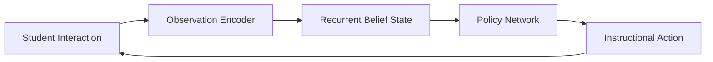
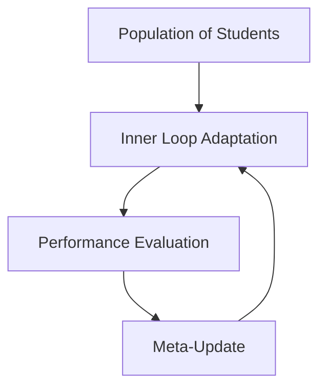

# StudentIO

## Overview

StudentIO is a meta-learning system designed to model how a student learns over time and to adapt instructional strategies accordingly. At its core, StudentIO treats learning as a dynamical system: the student has an internal knowledge state that cannot be observed directly, and the system must infer this state from observable evidence such as problem attempts, uploaded coursework, projects, and interactions.

The goal of the system is not to store answers, but to continuously refine its belief about what the student understands and to select actions that improve learning efficiency and long-term mastery.

This repository focuses on the mathematical structure, inference pipeline, and meta-learning formulation that underpins StudentIO. The implementation is deliberately grounded in established concepts from control theory, probabilistic modeling, and recurrent neural networks, ensuring that the system is interpretable, extensible, and suitable for rigorous evaluation.

---

## Learning as a Dynamical System

We model a student as a latent dynamical process evolving over discrete time steps. At each time step, the student has an internal knowledge state that represents their true understanding across topics, skills, and abstractions. This state cannot be observed directly. Instead, we observe evidence generated by the student, such as answers, partial solutions, code submissions, or written explanations.

Formally, let the latent student knowledge state at time step t be denoted by:

$$x_t \in \mathbb{R}^n$$

This vector encodes mastery levels, misconceptions, and conceptual connections. The system does not assume that $x_t$ is static. Learning, forgetting, and interference cause it to evolve over time according to a transition function:

$$x_{t+1} = f(x_t, u_t) + w_t$$

Here, $u_t$ represents the instructional action chosen by the system, such as presenting a problem, providing feedback, or assigning a project. The term $w_t$ captures stochastic effects such as fatigue, guessing, or external influences.

---

## Observation Model

While the knowledge state is hidden, the system observes outputs generated by the student. These observations are noisy reflections of the underlying state. Let the observation at time t be:

$$y_t \in \mathbb{R}^m$$

The observation model is defined as:

$$y_t = g(x_t) + v_t$$

The function g maps the latent knowledge state to measurable outputs such as correctness, response time, code quality, or conceptual completeness. The noise term $v_t$ accounts for randomness and measurement error.

This formulation allows StudentIO to unify many data modalities under a single probabilistic framework.

---

## Belief State and Inference

Because $x_t$ cannot be directly observed, StudentIO maintains a belief distribution over possible knowledge states. This belief is updated sequentially as new observations arrive. Let $b_t(x)$ denote the belief over $x_t$ given all observations up to time t.

The belief update follows a Bayesian filtering process:

$$b_t(x) \propto p(y_t | x) \int p(x | x_{t-1}, u_{t-1}) b_{t-1}(x_{t-1}) dx_{t-1}$$

In practice, this update is approximated using a recurrent neural network. The RNN acts as a learned inference engine that compresses the full belief distribution into a fixed-dimensional hidden state while preserving the information necessary for decision making.

---

## Recurrent Neural Inference Core

The recurrent core maintains a hidden state $h_t$ that represents the system's internal belief about the student.

$$h_t = \Phi(h_{t-1}, y_t, u_{t-1})$$

This recurrence approximates the Bayesian update described above. Unlike a generic sequence model, the recurrence is explicitly interpreted as belief propagation over time. This interpretation constrains architecture choices and allows for principled debugging and evaluation.

The hidden state $h_t$ is not the student knowledge itself. Instead, it is the system's best estimate of that knowledge given limited and noisy data.

---

## Action Selection and Control

At each time step, StudentIO selects an instructional action based on its current belief state. The action is chosen to optimize long-term learning outcomes rather than short-term correctness.

Let $\pi$ denote the policy mapping belief states to actions:

$$u_t = \pi(h_t)$$

The objective is to maximize expected cumulative learning gain:

$$J = \mathbb{E}\left[\sum_{t=0}^T R(x_t, u_t)\right]$$

where R measures progress toward mastery, retention, and transfer. This formulation aligns StudentIO with reinforcement learning and optimal control, while remaining grounded in interpretable educational objectives.

---

## Meta-Learning Across Students

StudentIO does not learn only within a single student. It also learns across students. Meta-learning allows the system to adapt quickly to a new student by leveraging patterns learned from previous students.

Formally, we treat each student as a task drawn from a distribution over learning dynamics. Meta-parameters $\theta$ govern the initialization and update rules of the inference and policy networks. During deployment, $\theta$ remains fixed while fast adaptation occurs through the recurrent state.

This separation enables rapid personalization without retraining the entire system.

---

## System Architecture

The high-level architecture is shown below. The diagram uses valid Mermaid syntax and renders correctly in GitHub.

This closed loop highlights the control-theoretic structure of the system. Actions influence the student, observations update beliefs, and beliefs drive future actions.

---

## Meta-Learning Loop

Across many students, StudentIO optimizes its meta-parameters to improve adaptation speed and instructional effectiveness.

This loop operates offline or asynchronously, ensuring that deployment-time inference remains lightweight and responsive.

---

## Scope of This Repository

This repository provides the theoretical foundation and architectural specification for StudentIO. It is intended as a reference for implementation in Julia and CUDA, with a frontend layer built on a modern web framework.

The emphasis is on correctness, interpretability, and extensibility rather than premature optimization. StudentIO is designed to scale from small classroom deployments to large populations while preserving individualized learning trajectories.

---

## Related Work and Theoretical Foundation

StudentIO builds upon established research in AI-enabled educational systems and adaptive learning. The theoretical framework draws from recent advances in virtual teaching assistants, personalized learning systems, and hybrid intelligence models that emphasize teacher-mediated AI orchestration.

The integration of knowledge state inference with instructional decision-making aligns with contemporary approaches to educational AI that emphasize:
- Personalized and adaptive learning pathways
- Real-time knowledge assessment through observable evidence
- Context-aware interaction and student modeling
- Integration with existing educational infrastructure
- Teacher agency in AI-driven educational environments

### Key Theoretical Foundations

**AI-Enabled Virtual Teaching Assistants**

Sajja et al. (2024) demonstrate how AI-powered intelligent assistants can provide personalized support in higher education through retrieval-augmented generation, adaptive content delivery, and multi-modal learning support. Their framework emphasizes reducing cognitive load while maintaining pedagogical rigor through evidence-based instructional design.

**Sajja, R., Sermet, Y., Cikmaz, M., Cwiertny, D., & Demir, I. (2024).** Artificial Intelligence-Enabled Intelligent Assistant for Personalized and Adaptive Learning in Higher Education. *Information*, 15(10), 596. https://doi.org/10.3390/info15100596

**Hybrid Intelligence and Teacher Orchestration**

Hernández-Herrera et al. (2026) propose the Dynamic Integration Model, which positions AI not as a replacement for instruction but as a scalability mechanism for teacher-led orchestration. Their empirical work validates that student perception of educational equity is strongly correlated with perceived relevance (r = 0.72), and that AI-driven personalization achieves high satisfaction when implemented through structured teacher-mediated workflows.

**Hernández-Herrera, J. R., Ortiz-Bejar, J., & Ortiz-Bejar, J. (2026).** Adaptive and Personalized Learning in Higher Education: An Artificial Intelligence-Based Approach. *Education Sciences*, 16(1), 109. https://doi.org/10.3390/educsci16010109

### Alignment with StudentIO Architecture

Both frameworks inform StudentIO's design philosophy:
- **Scalability without automation**: AI handles content variation while teachers maintain strategic oversight
- **Evidence-based adaptation**: Learning decisions grounded in diagnostic data rather than static assumptions
- **Ethical constraints**: Explicit guardrails against bias, privacy violations, and cognitive dependence
- **Dynamic clustering**: Grouping students by inferred knowledge patterns rather than demographic categories

These principles ensure that StudentIO operates as a teacher-augmentation system rather than a teacher-replacement system, preserving human pedagogical judgment while enabling personalization at scale.

---

## License and Research Use

This project is intended for research, experimentation, and educational use. Any deployment in high-stakes settings should be accompanied by rigorous validation, bias analysis, and human oversight.
